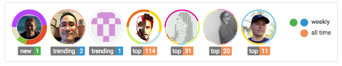

# README from README

Esse conteúdo, explica e modula a melhor maneira de criar um README com potencial e organizado. Seguindo as dicas e o passo a passo chegaremos a um ótimo potencial. **“A ideia  é que sempre se orgulhe de todo seu trabalho, começando pelo Readme que contém toda a descrição dele.”**

# Título 
 
Título NOME : Autoexplicativo para o projeto.
 
## Descrição
Descrever o que pretende alcançar com seu projeto, organizando da seguinte forma:
 
#### Objetivos Gerais: 
Costuma ser escrito com uma **"Frase mais geral"**, respondendo a perguntar PARA QUE ? 
 
#### Objetivos Específicos: 
Descreve o que o projeto **"deseja alcançar"**, respondendo a pergunta O QUE ? 

# Distintivos or Badgest

Os distintivos é para mostrar o estado do projeto, por exemplo: testes, versão, estado de build, etc.

#### Segue modelo abaixo:

 

  

## Link para criação e exemplos:

[Sheilds.IO](https://shields.io/#/)

[Badges no GitHub](https://medium.com/@thiagoloureiro/badges-no-github-bf8289496c7d)

# Visual - "Mostrar visualmente o projeto"
 
Nesse espaço seria ideal, que você coloque a uma imagem-"Captura de tela"/gif/vídeo o que achar melhor que representa o projeto. 
 
# Instalação
 
Escrever uma breve introdução ao processo de instalação.
 
**Exemplo:** 
Essas instruções farão com que você tenha uma cópia do projeto em execução na sua máquina local para fins de desenvolvimento e teste.
 
## Pré-requisitos
 
Descrever o que precisa ter instalado no computador para rodar o projeto.
 
Exemplo: Para a execução do projeto em sua máquina, deverá conter as seguintes dependências instaladas a partir das versões:
"Colocar a opção dos Badges (Distintivos)" ou descrever em linha de comando.
 
## Instalando 
 
Descrever uma série de passo a passo com exemplos, de como colocar o projeto em execução.
 
* Primeiro: Um parágrafo explicando a execução do comando.
* Segundo: A linha de comando.
 
Exemplo: Para instalar as dependências do projeto, execute os seguintes comandos no terminal:
 
    npm install
 
# Executando os Testes
 
Descrever o porquê e a necessidade de fazer o teste no projeto.
 
## Iniciando
 
Descrever como executar o teste automatizado.
 
Seguindo de passo a passo:
* Primeiro: Um parágrafo explicando a execução do comando.
* Segundo: A linha de comando.
 
### Teste de estilo de codificação - Opcional
 
Descrever um breve texto, com exemplos e execução do teste.

# Tecnologias Usadas no Projeto

Descrever as tecnologias usadas para desenvolver o projeto.

Exemplo:

* HTML - Estrutura para linguagem web
* Javascript - Linguagem de programação client-side
* Sass - Linguagem de folhas de estilo
 
# Autores e Reconhecimentos 
 
Mencionar as pessoas que criaram o projeto, com as seguintes informações:
 
* Nome : Isabela Silva
* Cargo: Front-End Developer 
* Github: Link para o github ou o que desejar colocar
 
## Hall da Fama - Opcional
 
Em projetos de grande escala e open source, essa seria um outro jeito de colocar os contribuintes do projeto.
 

Link : [Hall-Of-Fame](https://github.com/sourcerer-io/hall-of-fame) 

# Licença 
 
Para **"projetos de código aberto"** , descrever como é licenciado.
 
# Agradecimento
 
Descrever as inspirações, dicas, desenvolvimento e etc. Mencionar o resultado final (se desejar), por exemplo: colocar o link de acesso ao projeto. 
 
# Status do Projeto
"Colocar na parte superior do README". 

